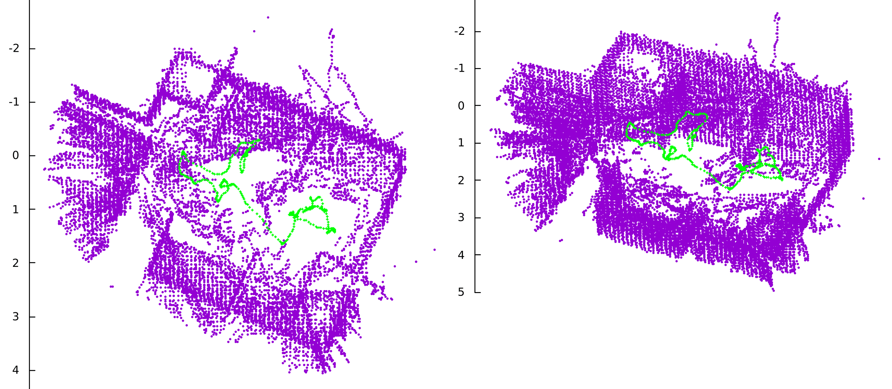

# Mapping

This is a linux package to create a global map of an environment using the D435 - Depth camera, and T265 - Tracking camera.

<p align="center">
  
</p>

## Getting Started

These instructions will get you a copy of the project up and running on your local machine for development and testing purposes.

### Prerequisites

The following packages are required for the project:
* [Realsense SDK 2.0](https://github.com/IntelRealSense/librealsense) - Used to interface with the cameras
* [OpenCV 3.0](https://docs.opencv.org/master/d7/d9f/tutorial_linux_install.html)
* [CUDA](https://docs.nvidia.com/cuda/cuda-installation-guide-linux/index.html) - Used to run C code on NVIDIA GPUs
* [GNUPlot](http://www.gnuplot.info/) - Used to display pointcloud data
* [GNUPlot IO stream](https://github.com/dstahlke/gnuplot-iostream) - Used to interface GNUPlot with C++
* [Thrust](https://github.com/thrust/thrust/wiki/Quick-Start-Guide) - Data parallel primitives on GPU
* [Boost](https://www.boost.org/doc/libs/1_57_0/more/getting_started/unix-variants.html) - Collection of portable C++ source libraries

### Installing

1. Change the current working directory to the location where you want the cloned directory to be made, and clone the GitHub repository

```
# Change to working directory
$ cd project-dir

# Clone the repository
$ git clone https://github.com/AkshayThiru/Mapping
```

2. Change to source directory and compile the code.

```
# Change to source directory
$ cd project-dir/src

# Compile the CPU version of the code
$ g++ -std=c++11 CPU_main.cpp -o CPU_main -lrealsense2 -lboost_iostreams -lboost_system -lboost_filesystem `pkg-config opencv --cflags --libs` -lpthread
```

3. Compile the GPU version of the code if applicable. CUDA version > 8.0 is required, and NVIDIA GPU should have compute capability > 2.0

```
# Compile the GPU version of the code
$ nvcc -std=c++11 GPU_main.cu -o GPU_main -lrealsense2 -lboost_iostreams -lboost_system -lboost_filesystem `pkg-config opencv --cflags --libs` -lpthread -Wno-deprecated-gpu-targets
```

4. Connect both the cameras and run the code.

```
# Run the CPU code
$ ./CPU_main

# Or run the GPU code
$ ./GPU_main
```

## Authors

* **T Akshay** - *Initial work* - [AkshayThiru](https://github.com/AkshayThiru)

See also the list of [contributors](https://github.com/AkshayThiru/Mapping/graphs/contributors) who participated in this project.
